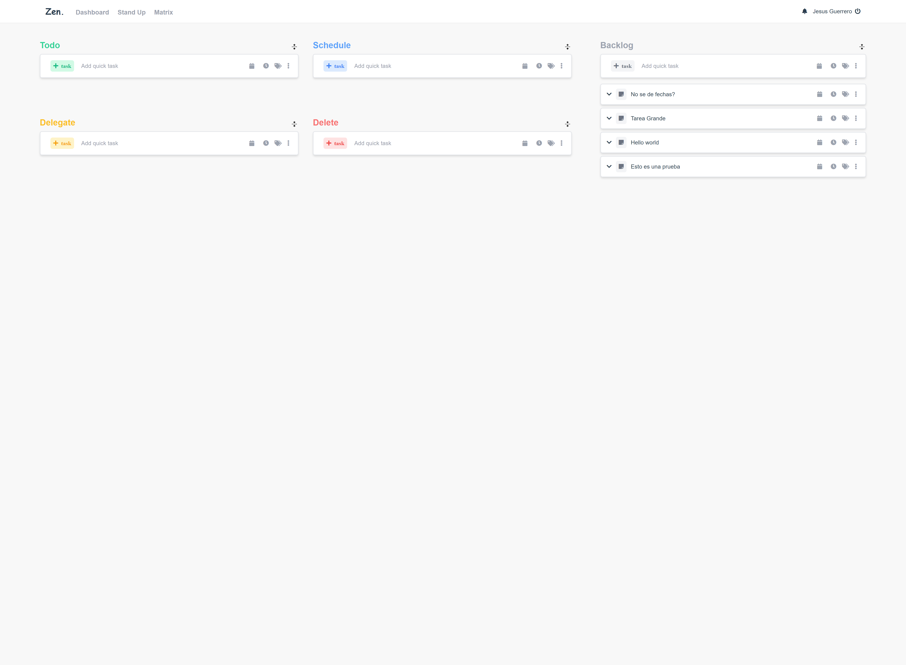

# zen

Keep yourself in the zone and focus in the moment.


<!-- PROJECT LOGO -->
<br />
<p align="center">
  <a href="https://zen.vercel.app/">
  </a>

  <h3 align="center">Zen.</h3>

  <p align="center">
    An awesome README template to jumpstart your projects!
    <br />
</p>


<!-- ABOUT THE PROJECT -->
## About The Project




There are many great README templates available on GitHub, however, I didn't find one that really suit my needs so I created this enhanced one. I want to create a README template so amazing that it'll be the last one you ever need -- I think this is it.

Sections:
* Zen Board
* Standup
* Matrix Board
* Plan Ahead

Features:
* Promodoro
* Heisenhower Matrix
* Standup

.

### Built With

I used the following.

* [Vue 3]()
* [Vite]()
* [Tailwindcss]()
* [firebase auth]()
* [firebase firestore]()
* [vercel]()


<!-- GETTING STARTED -->
## Getting Started

This is an example of how you may give instructions on setting up your project locally.

To get a local copy up and running follow these simple example steps.


### Prerequisites

This is an example of how to list things you need to use the software and how to install them.
* npm
  ```sh
  npm install npm@latest -g
  ```

### Installation

1. Get a free API Key at [https://example.com](https://example.com)
2. Clone the repo
   ```sh
   git clone https://github.com/your_username_/Project-Name.git
   ```
3. Install NPM packages
   ```sh
   npm install
   ```

<!-- USAGE EXAMPLES -->


<!-- ROADMAP -->
## Roadmap

See the [open issues](https://github.com/othneildrew/Best-README-Template/issues) for a list of proposed features (and known issues).


<!-- LICENSE -->
## License

Distributed under the MIT License. See `LICENSE` for more information.


<!-- CONTACT -->
<!-- ## Contact -->

<!-- Your Name - [@your_twitter](https://twitter.com/your_username) - email@example.com

Project Link: [https://github.com/your_username/repo_name](https://github.com/your_username/repo_name) -->


