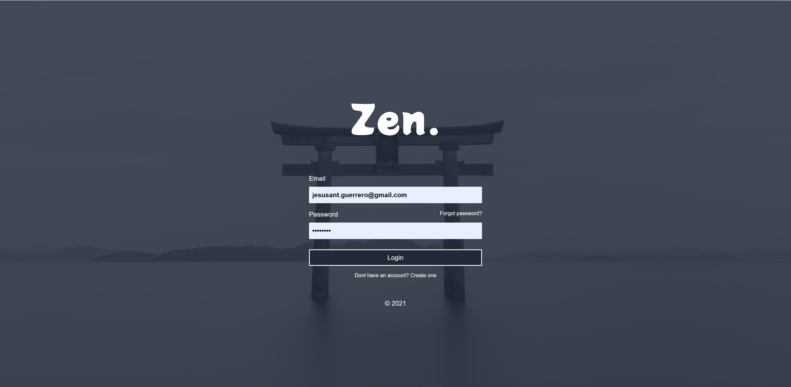

<!-- PROJECT LOGO -->
<br />
<p align="center">
  <a href="https://zen.vercel.app/">
  </a>

  <h3 align="center">Zen.</h3>

  <p align="center">
    Keep yourself in the zone and focus in the moment.
    <br />
</p>


<!-- ABOUT THE PROJECT -->
## About Zen.
__Zen.__ is a productivity app that integrates Eisenhower Matrix, Pomodoros, and part of the Get Things Done (GTD) principles in a unique way, to improve your developer routine. The purpose of Zen is to help you staying in the zone.




## Demo

[Zen. App](https://zen.vercel.app/)
## Sections
#### Zenboard:

Section when I can see my main task at the time detailed, a pomodoro timer to track the sessions of work, and a line up of task titles to know what is coming next.

#### Plan Ahead:

Section that will allow users to add, prioritize them according to the Eisenhower Matrix principle their tasks and build the line up of the day.

#### Stand Up:

Section will contain the committed task of previous days and help developers to have this info in hand for daily scrum meetings.

#### Matrix:

Will be the standalone screen of Eisenhower Matrix plus the backlog of unprioritized tasks.

## Features

1. Tasks with checklists.

2. Pomodoro + TimeTracker in One.

3. Mobile friendly

4. Eisenhower Matrix
.

### Built With

I used the following.

* [Vue 3](https://v3.vuejs.org/)
* [Vite](https://vitejs.dev/)
* [Tailwindcss](https://tailwindcss.com/)
* [firebase (auth & firestore)](https://firebase.google.com/)
* [vercel](https://vercel.com/docs)


<!-- GETTING STARTED -->
## Getting Started

### Prerequisites

| Prerequisite                                          | Version |
| ------------------------------------------------------| ------- |
| [Node.js](http://nodejs.org)                          | `~ ^12.0.0`  |
| [Firebase project (firestore and auth)](https://console.firebase.google.com/u/0/)                                |    --   |

```shell
node -v
```
### Installation

1. Clone the repo
   ```sh
   git clone https://github.com/jesusantguerrero/zen.git
   ```
2. Install NPM packages
   ```sh
   npm install
   ```

copy .env.example to .env:

```bash
# Remember place your firebase info there:
cp .env .env.local

```

3. Run in development mode
   ```sh
   npm run dev
   ```

3. Build
   ```sh
   npm run build
   ```

<!-- USAGE EXAMPLES -->


<!-- LICENSE -->
## License

Distributed under the MIT License. See `LICENSE` for more information.


