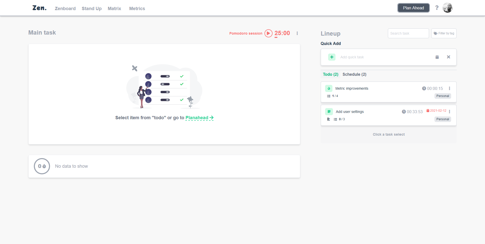

<!-- PROJECT LOGO -->
<br />
<p align="center">
  <a href="https://zen.vercel.app/">
  </a>

  <h3 align="center">Zen.</h3>

  <p align="center">
    Keep yourself in the zone and focus in the moment.
    <br />
</p>


<!-- ABOUT THE PROJECT -->
## About The Project




__Zen.__ is a productivity app that aim to keep the users with foucus in the most important things/tasks for the day, plan your day routine and provide a standup summary to tell in those agile meetings in a granular way.

Sections:
* Zen Board
* Standup
* Matrix Board
* Plan Ahead

Features:
* Promodoro
* Heisenhower Matrix
* Standup

.

### Built With

I used the following.

* [Vue 3]()
* [Vite]()
* [Tailwindcss]()
* [firebase auth]()
* [firebase firestore]()
* [vercel]()


<!-- GETTING STARTED -->
## Getting Started

### Prerequisites

This is an example of how to list things you need to use the software and how to install them.
* npm
  ```sh
  npm install npm@latest -g
  ```

### Installation

1. Clone the repo
   ```sh
   git clone https://github.com/your_username_/Project-Name.git
   ```
2. Install NPM packages
   ```sh
   npm install
   ```
3. Run in development mode
   ```sh
   npm run dev
   ```

3. Build
   ```sh
   npm run build
   ```

<!-- USAGE EXAMPLES -->


<!-- ROADMAP -->
## Roadmap

See the [open issues](https://github.com/othneildrew/Best-README-Template/issues) for a list of proposed features (and known issues).


<!-- LICENSE -->
## License

Distributed under the MIT License. See `LICENSE` for more information.


<!-- CONTACT -->
<!-- ## Contact -->

<!-- Your Name - [@your_twitter](https://twitter.com/your_username) - email@example.com

Project Link: [https://github.com/your_username/repo_name](https://github.com/your_username/repo_name) -->


